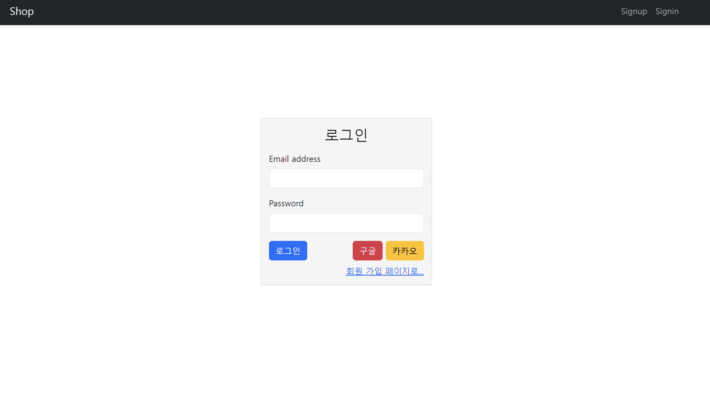

# NodeJS_Shoppingmall

## 프로젝트 설명
이 프로젝트는 전자상거래 기능을 구현한 Node.js 기반의 웹 애플리케이션입니다. 주요 기능은 다음과 같습니다:

- **소셜 로그인**: 구글 및 카카오 계정을 사용하여 로그인할 수 있습니다.
- **관리자 모드**: 관리자 권한으로 상품을 관리하고, 사용자 활동을 모니터링할 수 있습니다.
- **고객 모드**: 고객이 상품을 검색하고, 장바구니에 담고, 결제할 수 있습니다.
- **상품 구매**: 고객이 상품을 구매할 수 있는 기능입니다.
- **장바구니 담기**: 고객이 원하는 상품을 장바구니에 담을 수 있는 기능입니다.
- **결제 기능**: portone을 이용하여 고객이 장바구니에 담은 상품을 결제할 수 있는 기능입니다.

### 소셜 로그인
구글 및 카카오 계정을 사용하여 간편하게 로그인할 수 있는 기능입니다. OAuth 2.0을 사용하여 구현되었습니다.

